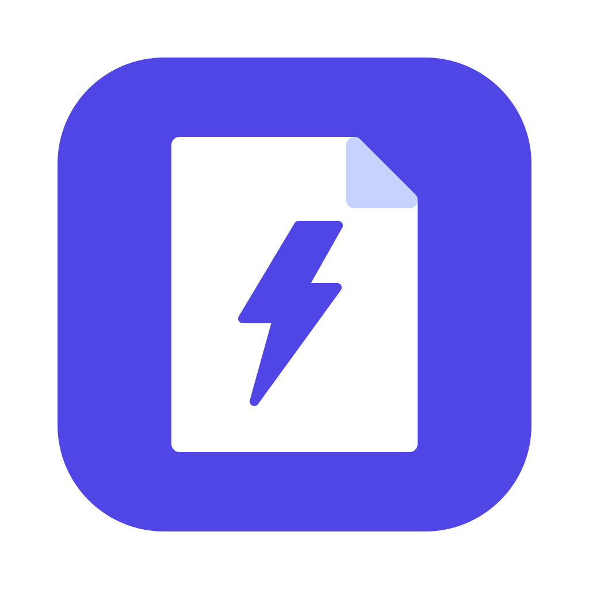

<p align="center">
  
</p>

<h1 align="center">DocZap</h1>

<p align="center">
  <strong>Fast, local, private DOCX to PDF conversion that keeps the layout intact.</strong>
</p>

<p align="center">
  <a href="https://github.com/arielr550/doczap/actions/workflows/tests.yml"></a>
  <a href="LICENSE"></a>
  
</p>

---

## Why DocZap

### 🔒 Local and private

Your documents never leave your computer.

- No cloud services, no APIs, no accounts and no telemetry.
- DocZap makes no network calls, and it stops LibreOffice from downloading
  images that a document only links to on the web.
- Nothing runs in the background. DocZap starts when you use it and exits when
  the conversion is done.

### 📐 Keeps your formatting

The PDF looks like the document you wrote.

- Documents are rendered by LibreOffice's layout engine, not rebuilt by a script,
  so pages, fonts, spacing, tables and images stay where they belong.
- A document LibreOffice cannot read fails loudly. DocZap never passes off an old
  or empty PDF as a successful result.

### ⚡ Super fast

Converting a simple document takes about a second on an Apple Silicon Mac.

- LibreOffice's first-start setup runs once and is cached, not repeated for every
  file.
- No update checks, downloads or waiting on the network.
- Drop several files on the app at once. Each PDF lands beside its original, with
  nothing to configure.

## Platform support

| Platform | Status |
|---|---|
| macOS | ✅ Supported (command line and app) |
| Linux | 🛠️ Planned |
| Windows | 🛠️ Planned |

The conversion core is kept platform-neutral, and everything OS-specific lives in
[`src/doczap/system.py`](src/doczap/system.py), so support for more platforms can
be added without touching the converter.

## Requirements

- [LibreOffice](https://www.libreoffice.org/download/download/), installed with
  `brew install --cask libreoffice` or from the `.dmg` into `/Applications`
- [uv](https://docs.astral.sh/uv/getting-started/installation/), installed with
  `brew install uv` or the official installer. uv provides Python 3.10+ if needed.

## Using the Mac app

Build the app once, and again after updating DocZap:

```bash
git clone https://github.com/arielr550/doczap.git
cd doczap
uv run python scripts/build_macos_app.py
```

Open `dist/DocZap.app` and choose one or more Word documents, or drag DOCX files
onto the app. Each PDF is saved beside its original. If a PDF with the same name
already exists, DocZap asks before replacing it.

You can move the app to `/Applications` or the Dock. It still needs LibreOffice
and uv to be installed. The app is signed only for your own Mac, so share the
source rather than the built app.

## Using the command line

Install the `doczap` command:

```bash
uv tool install git+https://github.com/arielr550/doczap.git
```

Convert a document. The PDF is saved beside it:

```bash
doczap report.docx
```

Choose a different output path, and allow replacing an existing file:

```bash
doczap report.docx ~/Desktop/final.pdf --overwrite
```

DocZap never overwrites an existing PDF unless you pass `--overwrite`.

From a clone of the repository you can also run `./doczap report.docx` without
installing the command.

## Fonts and fidelity

The layout matches Word only when the document's fonts are available to
LibreOffice. When a font is missing, LibreOffice silently substitutes another one,
which shifts line breaks and page counts.

Microsoft's default fonts (Calibri, Cambria) are usually missing on a Mac, and
Microsoft Office for Mac keeps its fonts inside its own app bundle where
LibreOffice cannot see them. Install the metric-compatible replacements, which
have identical character widths:

```bash
brew install --cask font-carlito font-caladea
```

For other fonts (for example Aptos), install the actual font files system-wide.

## Privacy and resource details

- LibreOffice uses a private profile cached in `~/Library/Caches/doczap/lo-profile`
  (about 0.5 MB). Delete the folder to reset it. If two conversions run at the
  same time, the second one uses a temporary profile.
- Each conversion is limited to 60 seconds.
- DocZap installs no login item, background service, watcher or scheduled task.
- A PDF is rendered in a temporary folder and moved into place only once it is
  complete, so a failed conversion never leaves a half-written file behind.

## Development

Run the tests:

```bash
uv run python -m unittest discover -s tests
```

`tests/test_integration.py` performs real conversions and is skipped when
LibreOffice is not installed.

```text
├── doczap                   # launcher for running from a clone
├── main.py                  # shim for `uv run python main.py`
├── assets/logo.svg          # logo, also rendered into the app icon
├── src/doczap/
│   ├── cli.py               # the `doczap` command
│   ├── desktop.py           # helper behind the macOS app
│   ├── conversion.py        # validation and converter selection
│   ├── system.py            # OS-specific paths and file locking
│   ├── converters/          # conversion engines (LibreOffice today)
│   └── utils/file_ops.py
├── scripts/build_macos_app.py
└── tests/
```

### Adding a conversion

1. Add a converter class implementing `Converter` in `src/doczap/converters/`.
2. Route to it from `select_converter(...)` in `src/doczap/conversion.py`.

The command line and the app need no changes.

## Roadmap

- Linux and Windows support
- Batch and folder conversion (`doczap *.docx`)
- More formats, such as DOCX to HTML or text

## License

[MIT](LICENSE)
